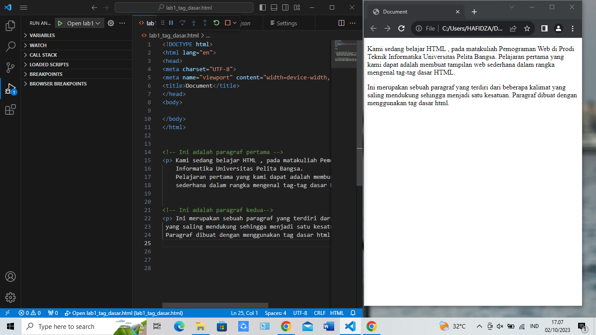
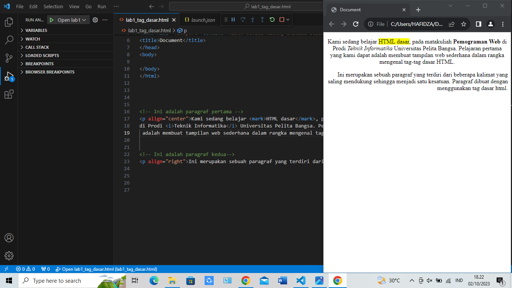
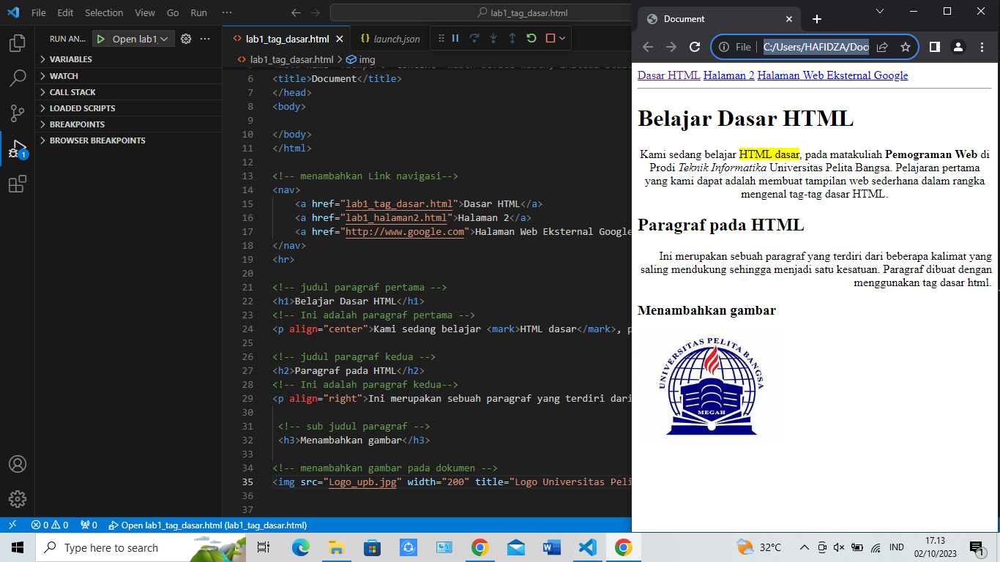
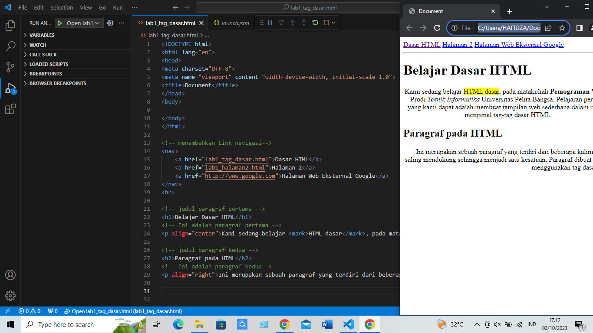

# Lab1web

 ```
<!-- Ini adalah paragraf pertama -->
<p>Kami sedang belajar HTML dasar, pada matakuliah Pemograman Web di Prodi Teknik Informatika
 Universitas Pelita Bangsa. Pelajaran pertama yang kami dapat adalah membuat tampilan web sederhana 
dalam rangka mengenal tag-tag dasar HTML.</p>


<!-- Ini adalah paragraf kedua-->
<p>Ini merupakan sebuah paragraf yang terdiri dari beberapa kalimat
 yang saling mendukung sehingga menjadi satu kesatuan. Paragraf dibuat dengan menggunakan tag dasar html.</p>
```



```
<!-- Ini adalah paragraf pertama -->
<p align=”center”>Kami sedang belajar HTML dasar, pada matakuliah Pemrograman
Web di Prodi Teknik Informatika Universitas Pelita Bangsa. Pelajaran pertama
yang kami dapat adalah membuat tampilan web sederhana dalam rangka mengenal
tag-tag dasar HTML.</p>
<!-- Ini adalah paragraf kedua -->
<p align=”right”>Ini merupakan sebuah paragraf yang terdiri dari beberapa
kalimat yang saling mendukung sehingga menjadi satu kesatuan. Paragraf dibuat
dengan menggunakan tag dasar html.</p>
```



```
 <!-- sub judul paragraf -->
 <h3>Menambahkan gambar</h3>

<!-- menambahkan gambar pada dokumen -->

```



```
<!-- menambahkan link navigasi -->
<nav>
<a href="lab1_tag_dasar.html">Dasar HTML</a>
<a href="lab1_halaman2.html">Halaman 2</a>
<a href="http://www.google.com">Halaman Web Eksternal Google</a>
</nav>
<hr>
```



# Pertanyaan 

1. Lakukan perubahan pada kode sesuai dengan keinginan anda, amati perubahannya adakah
error ketika terjadi kesalahan penulisan tag?

2. Apa perbedaan dari tag <p> dengan tag <br>, berikan penjelasannya!

3. Apa perbedaan atribut title dan alt pada tag , berikan penjelasannya!

4. Untuk mengatur ukuran gambar, digunakan atribut width dan height. Agar tampilan gambar
proporsional sebaiknya kedua atribut tersebut diisi semua atau tidak? Berikan penjelasannya
!

5. Pada link tambahkan atribut target dengan nilai atribut bervariasi ( _blank, _self, _top,
_parent ), apa yang terjadi pada masing-masing nilai antribut tersebut


# Jawaban 

1. Perubahan pada kode sudah saya coba mungkin ada beberapa yang menjadi eror karna saya kurang menambahkan beberapa dan terlalu buru buru kata sehingga hasil nya menjadi eror tapi setelah saya lakukan beberapa kali tidak ada eror atau kesalahan lagi

2# Tag  <p> di gunakan untuk kita dalam membuat paragraf teks atau untuk blok teks 
- setiap kali kita menggunakan tag akan di mulai dengan garis baru memiliki garis atas dan bawah
- dan juga secara otomatis memberikan margin atau jarak

#  Tag<br> 
digunakan untuk membuat pemisah baru dalam teks

- ketika anda ingin menambah jarak antara dua elemen teks 
- menambah spasi atas dan juga bawah secara default 

3
- Atribut alt (Alternate Text):
Atribut alt digunakan untuk memberikan teks alternatif untuk gambar. Ini adalah teks yang akan ditampilkan jika gambar tidak dapat dimuat, jika pengguna menggunakan perangkat pembaca layar, atau jika pengguna mematikan gambar dalam peramban mereka.

- Atribut title digunakan untuk memberikan judul atau informasi tambahan tentang gambar saat pengguna mengarahkan kursor mouse ke gambar tersebut. Ini akan menampilkan tooltip yang berisi teks yang diberikan dalam atribut title.

4 

- Ketika Anda mengisi kedua atribut width dan height dengan nilai yang sesuai, gambar akan ditampilkan dengan ukuran yang tepat, dan proporsinya akan terjaga. Ini sangat disarankan, terutama jika Anda ingin menjaga tampilan gambar tetap proporsional dan menghindari distorsi.

- Sebaiknya, dalam kebanyakan kasus, sangat disarankan untuk mengisi kedua atribut width dan height untuk mengontrol ukuran gambar dengan tepat dan menjaga proporsionalitasnya. Namun, jika Anda hanya ingin mengontrol satu dimensi dan membiarkan dimensi lainnya disesuaikan otomatis, Anda dapat mengisi salah satu atribut dan biarkan yang lainnya kosong atau tidak diisi

5

-Ketika Anda menggunakan target="_blank", tautan akan dibuka di jendela atau tab baru dalam peramban web.

-_blank Efek: Tautan akan membuka halaman yang terkait dalam jendela atau tab browser baru.

-target="_self" adalah nilai default dari atribut target. Ketika tautan memiliki target="_self", tautan akan dibuka di jendela atau tab yang sama di mana tautan tersebut berada.

-top:
 Ketika Anda menggunakan target="_top", tautan akan membuka halaman baru di jendela atau tab yang paling atas dalam hierarki jendela peramban.

-target="_parent" digunakan ketika Anda memiliki bingkai (frames) dalam halaman web Anda. Tautan ini akan membuka halaman baru di bingkai atau jendela "induk" dari bingkai tempat tautan tersebut berada.
